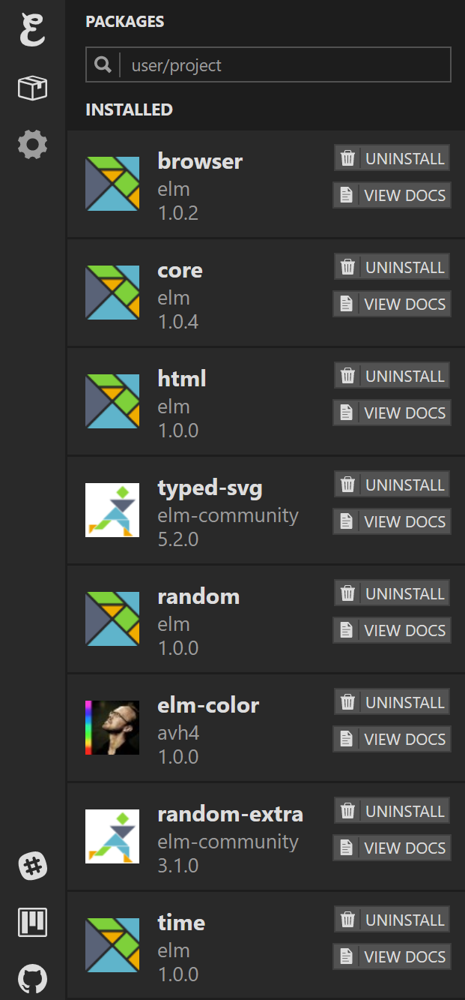

# natural-simulations
Natural simulations in Elm based on "Advanced JS: Natural Simulations" from Khan Academy.

# How to run simulations
## Run online in Ellie
1. Pick one of the following simulations and copy the elm code to [Ellie](https://ellie-app.com/new). 

2. Reference the direct dependencies section of the `elm.json` file to install necessary packages on Ellie.

Sample elm.json
```json
{ ...
  "dependencies": {
    "direct": {
      "avh4/elm-color": "1.0.0",
      "elm/browser": "1.0.2",
      "elm/core": "1.0.4",
      "elm/html": "1.0.0",
      "elm/random": "1.0.0",
      "elm/time": "1.0.0",
      "elm-community/random-extra": "3.1.0",
      "elm-community/typed-svg": "5.2.0"
    },
    ...
  }
  ...
}
```

Search for the package names listed in `elm.json` and click install.



3. Don't forget to change the module name in the Elm initialization of the Html section of Ellie.

```js
    // remember to change `RandomWalks.Basic` to the current module name
    var app = Elm.RandomWalks.Basic.init({ node: document.querySelector('main') })
```

Example of the basic random walker in Ellie:
https://ellie-app.com/7Q8sWsv5KH3a1

# Run locally
1. Clone this repository in a folder of your choice
```bash
git clone https://github.com/AlienKevin/natural-simulations
```
2. In the command line, run simulations with
```bash
elm reactor
```
3. Navigate to `http://localhost:8000` and select the simulation you want

# Table of Contents
## Randomness
Random walks
  - [Basic walker](./src/RandomWalks/Basic.elm) - [Try it out!](https://ellie-app.com/7Q8sWsv5KH3a1)
  - [Improved walker](./src/RandomWalks/Improved.elm)

Challenge: Random blobber
  - Same as [Improved walker](./src/RandomWalks/Improved.elm)

Probability & non-uniform distributions
  - [Directed walker](./src/RandomWalks/Directed.elm) that moves to the right

Challenge: Up walker
  - You can slightly modify the [Directed walker](./src/RandomWalks/Directed.elm) to make it move up

Normal distribution of random numbers
  - [Normal Distribution](./src/RandomWalks/NormalDistribution.elm)

Challenge: Gaussian walk
  - [Gaussian walker](./src/RandomWalks/Gaussian.elm)

Custom distribution of random numbers
  - [Monte Carlo](./src/RandomWalks/MonteCarlo.elm)

Challenge: Lévy walker
  - [Lévy Walker](./src/RandomWalks/Levy.elm)

Project: Paint splatter
  - [Paint Splatter](./src/RandomWalks/PaintSplatter.elm)

## Noise
Perlin noise
  - [Perlin Mountains](./src/Noise/Perlin.elm)
  - [Perlin Walker](./src/Noise/PerlinWalker.elm)

Challenge: Noisy step walker
  - [Perlin Step Walker](./src/Noise/PerlinStepWalker.elm)

Two dimensional noise
  - [Random Box](./src/Noise/RandomBox.elm)
  - [Perlin Box](./src/Noise/PerlinBox.elm)

Challenge: Animated noise
  - [Animated Box](./src/Noise/AnimatedBox.elm)

Project: Mountain range
  - [Mountain Range](./src/Noise/MountainRange.elm)

# Licenses
All code are made available under the following license: MIT license.

All non-code (such as writing, drawings, images, etc.) are also owned by their respective author and made available under the following license: Creative Commons Attribution License.